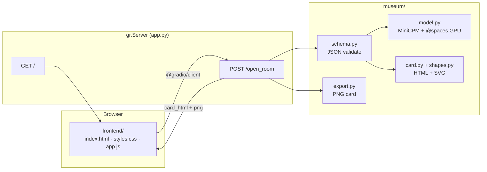

# Museum of Unlived Lives

*Some lives we live. Most we only imagine.*

Enter a counterfactual — a path you did not take. The curator builds a museum exhibit: title, narrative, artifact, and abstract visual style. Each result is saved to your personal gallery.

**Demo:** [build-small-hackathon/museum-of-unlived-lives](https://huggingface.co/spaces/build-small-hackathon/museum-of-unlived-lives)  
**Code:** [github.com/Rime504/museum-of-unlived-lives](https://github.com/Rime504/museum-of-unlived-lives)

**Model:** [MiniCPM4.1-8B Q4_K_M](https://huggingface.co/openbmb/MiniCPM4.1-8B-GGUF) · llama.cpp · `@spaces.GPU` on ZeroGPU

## Architecture



Custom HTML/CSS frontend — no default Gradio UI. Inference runs locally via llama.cpp; no external LLM API.

## Deploy on Build Small Hackathon org (ZeroGPU)

1. Create Space under **build-small-hackathon** → SDK **Gradio** → template **Blank**
2. **Settings → Hardware → ZeroGPU** (free with org PRO — 40 min GPU/day)
3. Push this repo:

```bash
git remote add hackathon https://huggingface.co/spaces/build-small-hackathon/museum-of-unlived-lives
git push hackathon main --force
```

4. Optional secrets (Settings → Variables and secrets):

| Secret | Value |
|--------|--------|
| `MUSEUM_N_GPU_LAYERS` | `-1` |
| `HF_TOKEN` | token with read access (faster model download) |

**Do not** set `MUSEUM_WARMUP=true` on ZeroGPU — the GPU is only allocated per request.

### Using your $40 credits wisely

| Do | Don't |
|----|--------|
| **ZeroGPU** as Space hardware (free tier + org PRO quota) | Leave **T4** running 24/7 ($0.40/hr ≈ $10/day) |
| Let Space **sleep** when idle (48h default) | Enable warmup on ZeroGPU |
| Use credits only if you **exceed 40 min/day** ZeroGPU ($1 / 10 min) | Spin up multiple paid GPU Spaces |
| Bundle GGUF via Git LFS once (optional) | Re-download 5 GB every cold start |

## Repository

```
app.py              gr.Blocks + custom / + /open_room API
frontend/           Custom UI (HTML, CSS, JS)
museum/             Model, prompts, schema, shapes, card, export
requirements.txt
scripts/            Optional: fetch weights, tests
```

Weights (`minicpm-8b-q4_k_m.gguf`, ~4.97 GB) download on first generation if not in repo. To bundle: `python scripts/fetch_gguf.py` then push via Git LFS.

## Run locally

```bash
pip install -r requirements.txt
python app.py
```

Open `http://localhost:7860`. (`spaces` is optional locally — runs on CPU/GPU without ZeroGPU.)

## Space settings

| Variable | Default | Purpose |
|----------|---------|---------|
| `MUSEUM_N_GPU_LAYERS` | `-1` | Full GPU offload when CUDA is available |
| `MUSEUM_WARMUP` | `false` | Preload model at startup (T4 only; not ZeroGPU) |
| `MUSEUM_N_CTX` | `4096` | Context window (4K keeps inference fast) |

Hardware: **ZeroGPU** on the hackathon org Space.
