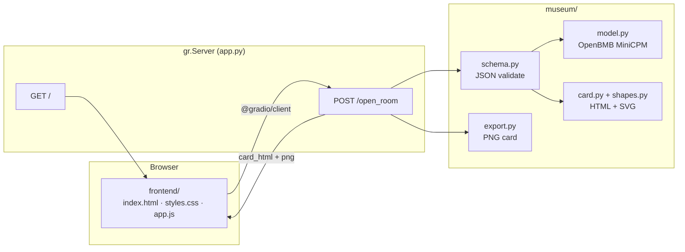

# Museum of Unlived Lives

*Some lives we live. Most we only imagine.*

**Track 2: Thousand Token Wood**

You type a path you didn't take — the job in Tokyo, the degree you walked away from, the version of you that stayed. A curator opens a room for it.

Not a chatbot. A museum.

Each counterfactual becomes an exhibit card: title, narrative, mood, artifact, and abstract geometry. Cards stack in your personal gallery in the browser. Walk the hall at night. Open any room. Download a high-res PNG keepsake.

**Try it:** [build-small-hackathon/museum-of-unlived-lives](https://huggingface.co/spaces/build-small-hackathon/museum-of-unlived-lives)

**Built by [false200](https://github.com/false200) and [Rime504](https://github.com/Rime504)** · **Code:** [github.com/Rime504/museum-of-unlived-lives](https://github.com/Rime504/museum-of-unlived-lives)

## Curated by [OpenBMB](https://huggingface.co/openbmb) [MiniCPM](https://huggingface.co/openbmb/MiniCPM4.1-8B-GGUF)

The soul of this project is **[MiniCPM4.1-8B](https://huggingface.co/openbmb/MiniCPM4.1-8B-GGUF)** — OpenBMB's compact open model, running fully local through llama.cpp. No API keys. No cloud round-trip. The model doesn't explain your life; it *curates* it — distilling a counterfactual into a tight, literary exhibit inside a bounded token budget.

That's the spirit of **Thousand Token Wood**: small wood, sharp grain. Every room is carved from a handful of tokens, not a novel.

- **OpenBMB MiniCPM** writes title, narrative, artifact, and mood palette
- **Fully local inference** — [MiniCPM4.1-8B Q4_K_M](https://huggingface.co/openbmb/MiniCPM4.1-8B-GGUF) (~5 GB), downloads on first run
- **Structured curator** — JSON schema + server-assigned SVG shapes keep exhibits varied and gallery-ready
- **Custom museum UI** — no default Gradio chrome; a full front door in `frontend/`

## What you'll get

Enter something like:

> I had taken the job in Tokyo instead of staying home

Click **Open this room**. The curator returns an exhibit — poetic copy, a physical artifact on the placard, mood colors, and one of eight abstract shapes chosen for that specific life. Save it to your gallery. Come back later. The museum remembers.

## How it works



Custom HTML/CSS frontend — no default Gradio UI. Eight abstract shapes are assigned server-side per counterfactual; MiniCPM writes the copy to match. Card export uses SnapDOM in the browser for pixel-accurate PNGs.

```
app.py              gr.Blocks + custom / + /open_room API
frontend/           Custom UI (HTML, CSS, JS)
museum/             Model, prompts, schema, shapes, card, export
requirements.txt
scripts/            Optional: fetch weights, tests
```

On a cold start, the first exhibit may take 1–2 minutes while MiniCPM loads; later rooms are faster.

---

## Run locally

When you want your own copy of the museum on your machine:

**Requirements:** Python 3.10 or 3.11, ~6 GB free disk (model + deps), internet on first run (model download).

| Path | Best for | Speed |
|------|----------|-------|
| **A — GPU (Linux / Windows + NVIDIA)** | Gaming laptop, Linux workstation, CUDA 12.x | Fast (~30–60 s per exhibit) |
| **B — CPU only** | No GPU, or CUDA install fails | Slow (~3–8 min per exhibit) |
| **C — Mac (Apple Silicon)** | M1 / M2 / M3 / M4 | Fast via Metal |

All paths use the same app — only `llama-cpp-python` install differs. The `spaces` package is optional locally (ZeroGPU decorator becomes a no-op).

### Quick start

```bash
git clone https://github.com/Rime504/museum-of-unlived-lives.git
cd museum-of-unlived-lives
python -m venv .venv
```

**Linux / macOS:** `source .venv/bin/activate`  
**Windows (PowerShell):** `.venv\Scripts\Activate.ps1`

Then follow **A**, **B**, or **C** below, and run:

```bash
python app.py
```

Open **http://localhost:7860**

### A — GPU (Linux / Windows + NVIDIA)

```bash
pip install -r requirements.txt
python app.py
```

**Optional env vars** (defaults are fine):

```bash
export MUSEUM_N_GPU_LAYERS=-1   # full GPU offload (Windows: set MUSEUM_N_GPU_LAYERS=-1)
export MUSEUM_N_CTX=4096
```

**If you see** `libcudart.so.12: cannot open shared object file` on Linux: the repo ships `nvidia-cuda-runtime-cu12` and preloads libs in `museum/model.py`. Reinstall deps:

```bash
pip install --force-reinstall -r requirements.txt
```

**CUDA version mismatch?** Swap the wheel index in `requirements.txt` — e.g. `cu121`, `cu122`, `cu123`, or `cu125` instead of `cu124` — to match your driver/CUDA install ([llama-cpp-python wheels](https://llama-cpp-python.readthedocs.io/en/latest/)).

### B — CPU fallback (no GPU)

Do **not** use the CUDA extra index. Install the CPU wheel and force CPU inference:

```bash
pip install gradio==6.16.0 spaces>=0.43.0 Pillow>=10.3.0 huggingface_hub>=0.24.0
pip install llama-cpp-python==0.3.23
```

**Linux / macOS:**

```bash
export MUSEUM_N_GPU_LAYERS=0
python app.py
```

**Windows (PowerShell):**

```powershell
$env:MUSEUM_N_GPU_LAYERS="0"
python app.py
```

Expect **3–8 minutes** per exhibit on a typical laptop CPU.

### C — Mac (Apple Silicon)

```bash
pip install gradio==6.16.0 spaces>=0.43.0 Pillow>=10.3.0 huggingface_hub>=0.24.0
CMAKE_ARGS="-DGGML_METAL=on" pip install llama-cpp-python==0.3.23
export MUSEUM_N_GPU_LAYERS=-1
python app.py
```

Metal build uses the GPU via llama.cpp; no NVIDIA/CUDA needed.

### Verify it works

1. App starts at `http://localhost:7860` with the custom museum UI (not default Gradio widgets).
2. Enter a counterfactual and click **Open this room**.
3. On startup, weights download — logs show `Warmup: weights ready on disk.`
4. You get an exhibit card: title, narrative, artifact, mood colors, abstract shape, and **Download card** (PNG).

**Harmless log:** `n_ctx_seq (4096) < n_ctx_train (65536)` — expected; 4K context is intentional.

**Troubleshooting**

| Symptom | Fix |
|---------|-----|
| `libcudart.so.12` / CUDA load error | Path **A**: reinstall `requirements.txt`. Path **B**: CPU install + `MUSEUM_N_GPU_LAYERS=0`. |
| Import error on Mac | Use Path **C** (Metal), not CUDA `requirements.txt`. |
| Very slow generation | Normal on CPU (Path **B**). Use GPU or Mac Metal for speed. |
| Empty or invalid JSON | Retry once; schema repair handles occasional bad output. |

## Environment variables

| Variable | Default | Purpose |
|----------|---------|---------|
| `MUSEUM_N_GPU_LAYERS` | `-1` | Full GPU offload when CUDA is available (`0` = CPU only) |
| `MUSEUM_WARMUP` | `true` | Download weights at startup |
| `MUSEUM_N_CTX` | `4096` | Context window |

## License

MIT
